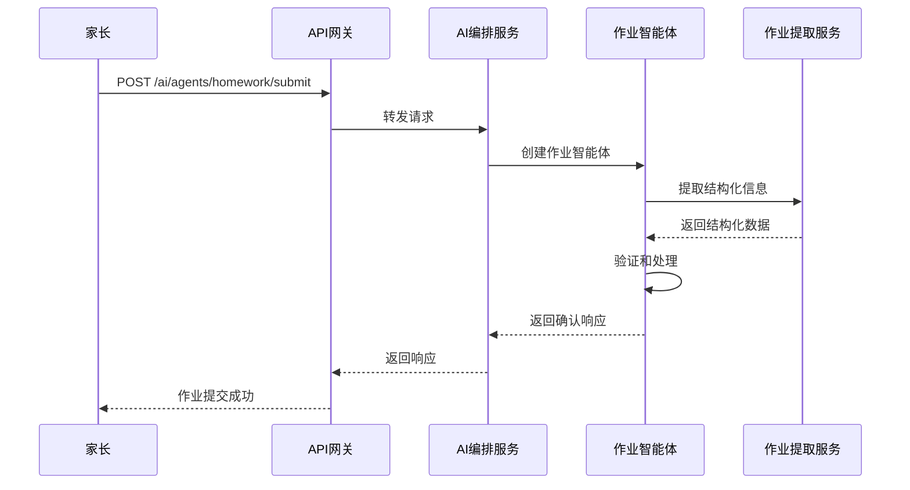
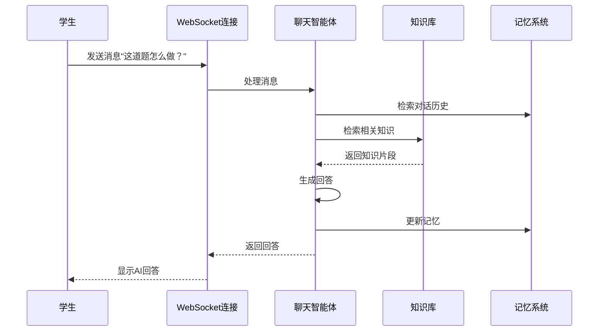

# 智能体架构和作业通用场景智能体设计

## 1. 智能体核心架构

### 1.1 智能体抽象层设计

```java
// 智能体类型枚举
public enum AgentType {
    HOMEWORK("作业智能体"),
    CHAT("聊天智能体"), 
    GRADING("批改智能体"),
    TUTOR("辅导智能体");
    
    private final String displayName;
    
    AgentType(String displayName) {
        this.displayName = displayName;
    }
}

// 智能体状态枚举
public enum AgentState {
    INITIALIZING("初始化中"),
    ACTIVE("活跃"),
    THINKING("思考中"),
    WAITING("等待中"),
    INACTIVE("非活跃"),
    ERROR("错误");
    
    private final String displayName;
    
    AgentState(String displayName) {
        this.displayName = displayName;
    }
}

// 智能体配置
@Data
public class AgentConfig {
    private String name;
    private String description;
    private AgentType type;
    private Map<String, Object> parameters; // 智能体特定参数
    private List<String> capabilities; // 启用的能力列表
    private int maxMemorySize; // 最大记忆容量
    private int idleTimeoutMinutes; // 空闲超时时间
}
```

### 1.2 智能体上下文管理

```java
// 智能体上下文
@Data
public class AgentContext {
    private String userId;
    private String sessionId;
    private LocalDateTime createTime;
    private LocalDateTime lastActiveTime;
    private Map<String, Object> sessionData; // 会话数据
    private UserPreferences userPreferences; // 用户偏好
    private LearningProfile learningProfile; // 学习档案
    private ConversationHistory conversationHistory; // 对话历史
}

// 用户偏好
@Data
public class UserPreferences {
    private String preferredLanguage;
    private DifficultyLevel preferredDifficulty;
    private boolean showDetailedExplanations;
    private boolean enableHints;
    private List<String> favoriteSubjects;
}

// 学习档案
@Data
public class LearningProfile {
    private Map<String, SubjectMastery> subjectMastery; // 各科目掌握程度
    private List<LearningGoal> learningGoals; // 学习目标
    private List<WeaknessArea> weaknessAreas; // 薄弱环节
    private PerformanceTrend performanceTrend; // 表现趋势
}

// 科目掌握程度
@Data
public class SubjectMastery {
    private String subject;
    private double masteryScore; // 掌握分数 (0-100)
    private List<TopicMastery> topicMastery; // 具体知识点掌握情况
    private LocalDateTime lastAssessed; // 最后评估时间
}
```

### 1.3 智能体记忆系统

```java
// 智能体记忆接口
public interface AgentMemory {
    void addMemory(MemoryItem item);
    List<MemoryItem> retrieveMemories(MemoryQuery query);
    void updateMemory(String memoryId, MemoryItem item);
    void deleteMemory(String memoryId);
    void clearMemories();
}

// 记忆项
@Data
public class MemoryItem {
    private String id;
    private MemoryType type;
    private String content;
    private Map<String, Object> metadata;
    private LocalDateTime timestamp;
    private double importance; // 重要性权重 (0-1)
    private int accessCount; // 访问次数
}

// 记忆类型
public enum MemoryType {
    FACT("事实记忆"),
    EXPERIENCE("经验记忆"),
    PREFERENCE("偏好记忆"),
    LEARNING("学习记忆"),
    CONVERSATION("对话记忆");
}

// 分层记忆实现
@Component
public class HierarchicalAgentMemory implements AgentMemory {
    
    // 短期记忆 - 使用本地缓存
    private final Cache<String, MemoryItem> shortTermMemory;
    
    // 长期记忆 - 使用Redis
    private final RedisTemplate<String, MemoryItem> longTermMemory;
    
    // 向量记忆 - 使用向量数据库
    private final VectorStore vectorMemory;
    
    @Override
    public void addMemory(MemoryItem item) {
        // 根据重要性和访问频率决定存储位置
        if (item.getImportance() > 0.7 || item.getAccessCount() > 5) {
            // 重要记忆存储到长期记忆
            longTermMemory.opsForValue().set(
                "memory:" + item.getId(), 
                item, 
                Duration.ofDays(30)
            );
            
            // 同时存储到向量记忆用于语义搜索
            vectorMemory.store(item.getId(), item.getContent(), item.getMetadata());
        } else {
            // 临时记忆存储到短期记忆
            shortTermMemory.put(item.getId(), item);
        }
    }
    
    @Override
    public List<MemoryItem> retrieveMemories(MemoryQuery query) {
        List<MemoryItem> results = new ArrayList<>();
        
        // 从短期记忆检索
        results.addAll(retrieveFromShortTerm(query));
        
        // 从长期记忆检索
        results.addAll(retrieveFromLongTerm(query));
        
        // 从向量记忆进行语义检索
        if (query.isSemanticSearch()) {
            results.addAll(retrieveFromVectorMemory(query));
        }
        
        // 去重和排序
        return deduplicateAndSort(results, query.getSortBy());
    }
}
```

## 2. 作业通用场景智能体详细设计

### 2.1 作业智能体核心功能

```java
// 作业智能体具体实现
@Component
@Scope("prototype")
public class HomeworkAgent extends BaseAgent {
    
    private final HomeworkExtractionService extractionService;
    private final HomeworkGradingService gradingService;
    private final HomeworkGuidanceService guidanceService;
    private final KnowledgeBaseService knowledgeBaseService;
    
    public HomeworkAgent(AgentConfig config, 
                        HomeworkExtractionService extractionService,
                        HomeworkGradingService gradingService,
                        HomeworkGuidanceService guidanceService,
                        KnowledgeBaseService knowledgeBaseService) {
        super(config);
        this.extractionService = extractionService;
        this.gradingService = gradingService;
        this.guidanceService = guidanceService;
        this.knowledgeBaseService = knowledgeBaseService;
        this.type = AgentType.HOMEWORK;
    }
    
    @Override
    public AgentResponse interact(AgentInteractionRequest request) {
        try {
            // 1. 意图识别
            UserIntent intent = recognizeIntent(request.getMessage());
            
            // 2. 上下文感知
            updateContextWithIntent(intent);
            
            // 3. 策略选择
            AgentStrategy strategy = selectStrategy(intent);
            
            // 4. 执行策略
            AgentResponse response = executeStrategy(strategy, request);
            
            // 5. 更新记忆
            updateMemory(request, response, intent);
            
            // 6. 更新学习档案
            updateLearningProfile(intent, response);
            
            return response;
        } catch (Exception e) {
            log.error("Error processing interaction for agent: " + getAgentId(), e);
            setState(AgentState.ERROR);
            return createErrorResponse(e);
        }
    }
    
    private UserIntent recognizeIntent(String message) {
        // 使用NLP模型识别用户意图
        IntentRecognitionResult result = nlpService.recognizeIntent(message);
        
        return UserIntent.builder()
            .type(result.getIntentType())
            .confidence(result.getConfidence())
            .entities(result.getEntities())
            .build();
    }
    
    private AgentStrategy selectStrategy(UserIntent intent) {
        switch (intent.getType()) {
            case SUBMIT_HOMEWORK:
                return new HomeworkSubmissionStrategy();
            case ASK_QUESTION:
                return new QuestionAnsweringStrategy();
            case REQUEST_HINT:
                return new HintProvidingStrategy();
            case REQUEST_GRADING:
                return new GradingRequestStrategy();
            case GENERAL_CHAT:
                return new GeneralConversationStrategy();
            default:
                return new FallbackStrategy();
        }
    }
}
```

### 2.2 作业智能体策略模式实现

```java
// 策略接口
public interface AgentStrategy {
    AgentResponse execute(AgentContext context, AgentInteractionRequest request);
    StrategyPriority getPriority();
}

// 作业提交策略
@Component
public class HomeworkSubmissionStrategy implements AgentStrategy {
    
    @Override
    public AgentResponse execute(AgentContext context, AgentInteractionRequest request) {
        // 1. 提取作业信息
        HomeworkExtractionRequest extractionRequest = buildExtractionRequest(request);
        HomeworkExtractionResponse extractionResponse = extractionService.extract(extractionRequest);
        
        // 2. 验证作业信息完整性
        ValidationResult validation = validateHomework(extractionResponse);
        if (!validation.isValid()) {
            return createValidationErrorResponse(validation);
        }
        
        // 3. 保存作业到数据库
        HomeworkEntity homework = saveHomework(extractionResponse, context.getUserId());
        
        // 4. 生成确认响应
        return AgentResponse.builder()
            .message("作业已成功提交！我会帮你分析这道题。")
            .responseType(ResponseType.TEXT)
            .suggestedActions(Arrays.asList(
                SuggestedAction.builder()
                    .type("SHOW_ANALYSIS")
                    .label("查看题目分析")
                    .build(),
                SuggestedAction.builder()
                    .type("REQUEST_HINT")
                    .label("请求提示")
                    .build()
            ))
            .metadata(Map.of("homeworkId", homework.getId()))
            .build();
    }
    
    private ValidationResult validateHomework(HomeworkExtractionResponse response) {
        List<String> errors = new ArrayList<>();
        
        if (response.getSubject() == null || response.getSubject().isEmpty()) {
            errors.add("未识别到科目信息");
        }
        
        if (response.getQuestions() == null || response.getQuestions().isEmpty()) {
            errors.add("未识别到具体题目");
        }
        
        return new ValidationResult(errors.isEmpty(), errors);
    }
}

// 问题解答策略
@Component
public class QuestionAnsweringStrategy implements AgentStrategy {
    
    @Override
    public AgentResponse execute(AgentContext context, AgentInteractionRequest request) {
        // 1. 从上下文中获取当前作业
        HomeworkEntity currentHomework = getCurrentHomework(context);
        
        // 2. 识别具体问题
        Question targetQuestion = identifyTargetQuestion(request.getMessage(), currentHomework);
        
        // 3. 检索相关知识
        List<KnowledgeChunk> relevantKnowledge = knowledgeBaseService.retrieveKnowledge(
            targetQuestion.getContent(), 
            currentHomework.getSubject()
        );
        
        // 4. 生成解答
        String explanation = generateExplanation(targetQuestion, relevantKnowledge, context.getLearningProfile());
        
        // 5. 构建响应
        return AgentResponse.builder()
            .message(explanation)
            .responseType(ResponseType.TEXT)
            .suggestedActions(Arrays.asList(
                SuggestedAction.builder()
                    .type("SHOW_STEP_BY_STEP")
                    .label("分步解析")
                    .build(),
                SuggestedAction.builder()
                    .type("SHOW_SIMILAR_PROBLEMS")
                    .label("类似题目")
                    .build(),
                SuggestedAction.builder()
                    .type("REQUEST_GRADING")
                    .label("提交答案批改")
                    .build()
            ))
            .build();
    }
}
```

### 2.3 作业智能体记忆和学习机制

```java
// 学习机制实现
@Component
public class HomeworkAgentLearningMechanism {
    
    public void updateLearningProfile(UserIntent intent, AgentResponse response, LearningProfile profile) {
        switch (intent.getType()) {
            case SUBMIT_HOMEWORK:
                updateSubjectExposure(profile, extractSubjectFromIntent(intent));
                break;
            case ASK_QUESTION:
                updateKnowledgeGaps(profile, intent, response);
                break;
            case REQUEST_GRADING:
                updatePerformanceMetrics(profile, intent, response);
                break;
        }
    }
    
    private void updateSubjectExposure(LearningProfile profile, String subject) {
        SubjectMastery mastery = profile.getSubjectMastery().getOrDefault(subject, 
            new SubjectMastery(subject, 0.0, new ArrayList<>(), LocalDateTime.now()));
        
        // 增加科目接触频率
        mastery.setLastAssessed(LocalDateTime.now());
        profile.getSubjectMastery().put(subject, mastery);
    }
    
    private void updateKnowledgeGaps(LearningProfile profile, UserIntent intent, AgentResponse response) {
        // 分析用户提问的难度和知识点
        KnowledgeGapAnalysis analysis = analyzeKnowledgeGaps(intent.getMessage(), response.getMessage());
        
        // 更新薄弱环节
        profile.getWeaknessAreas().addAll(analysis.getIdentifiedGaps());
    }
    
    private void updatePerformanceMetrics(LearningProfile profile, UserIntent intent, AgentResponse response) {
        // 从批改结果中提取性能指标
        GradingResult gradingResult = extractGradingResult(response);
        if (gradingResult != null) {
            updateSubjectMastery(profile, gradingResult);
            updatePerformanceTrend(profile, gradingResult);
        }
    }
    
    // 记忆更新机制
    public void updateMemory(AgentInteractionRequest request, AgentResponse response, UserIntent intent) {
        // 创建对话记忆
        MemoryItem conversationMemory = MemoryItem.builder()
            .id(UUID.randomUUID().toString())
            .type(MemoryType.CONVERSATION)
            .content(String.format("User: %s\nAgent: %s", request.getMessage(), response.getMessage()))
            .timestamp(LocalDateTime.now())
            .importance(calculateConversationImportance(intent, response))
            .metadata(Map.of(
                "intentType", intent.getType().name(),
                "responseType", response.getResponseType().name(),
                "sessionId", request.getSessionId()
            ))
            .build();
            
        agentMemory.addMemory(conversationMemory);
        
        // 创建学习记忆（如果是学习相关内容）
        if (isLearningRelated(intent)) {
            MemoryItem learningMemory = createLearningMemory(intent, response);
            agentMemory.addMemory(learningMemory);
        }
    }
}
```

## 3. 智能体编排和协调

### 3.1 多智能体协作

```java
// 智能体协调器
@Service
public class AgentOrchestrator {
    
    private final AgentLifecycleManager agentManager;
    private final AgentCapabilityRegistry capabilityRegistry;
    
    public AgentResponse coordinateAgents(CoordinationRequest request) {
        // 1. 分析任务复杂度
        TaskComplexity complexity = analyzeTaskComplexity(request.getTask());
        
        if (complexity == TaskComplexity.SIMPLE) {
            // 简单任务：使用单一智能体
            return handleSimpleTask(request);
        } else {
            // 复杂任务：协调多个智能体
            return handleComplexTask(request);
        }
    }
    
    private AgentResponse handleComplexTask(CoordinationRequest request) {
        // 创建主智能体（作业智能体）
        String mainAgentId = agentManager.createAgent(
            AgentCreateRequest.builder()
                .type(AgentType.HOMEWORK)
                .config(buildHomeworkAgentConfig())
                .build()
        );
        
        // 根据需要创建辅助智能体
        List<String> helperAgentIds = new ArrayList<>();
        
        if (needsChatSupport(request)) {
            String chatAgentId = agentManager.createAgent(
                AgentCreateRequest.builder()
                    .type(AgentType.CHAT)
                    .config(buildChatAgentConfig())
                    .build()
            );
            helperAgentIds.add(chatAgentId);
        }
        
        if (needsGradingSupport(request)) {
            String gradingAgentId = agentManager.createAgent(
                AgentCreateRequest.builder()
                    .type(AgentType.GRADING)
                    .config(buildGradingAgentConfig())
                    .build()
            );
            helperAgentIds.add(gradingAgentId);
        }
        
        // 协调执行
        AgentResponse mainResponse = agentManager.interact(mainAgentId, request.getMainRequest());
        
        // 收集辅助智能体的输入
        List<AgentResponse> helperResponses = helperAgentIds.stream()
            .map(agentId -> agentManager.interact(agentId, buildHelperRequest(request, agentId)))
            .collect(Collectors.toList());
        
        // 融合响应
        return fuseResponses(mainResponse, helperResponses);
    }
}
```

### 3.2 智能体状态监控

```java
// 智能体监控服务
@Service
public class AgentMonitoringService {
    
    private final MeterRegistry meterRegistry;
    private final AgentLifecycleManager agentManager;
    
    @Scheduled(fixedRate = 60000) // 每分钟
    public void monitorAgents() {
        Map<AgentState, Long> stateCounts = agentManager.getActiveAgents()
            .values()
            .stream()
            .collect(Collectors.groupingBy(BaseAgent::getState, Collectors.counting()));
            
        // 记录状态指标
        stateCounts.forEach((state, count) -> {
            Gauge.builder("agent.state.count", () -> count)
                .tag("state", state.name())
                .register(meterRegistry);
        });
        
        // 检测异常状态
        long errorCount = stateCounts.getOrDefault(AgentState.ERROR, 0L);
        if (errorCount > 0) {
            alertService.sendAlert("Agent Error Alert", 
                String.format("%d agents are in ERROR state", errorCount));
        }
        
        // 性能监控
        monitorAgentPerformance();
    }
    
    private void monitorAgentPerformance() {
        // 监控响应时间
        Timer.Sample sample = Timer.start(meterRegistry);
        // ... 执行操作
        sample.stop(Timer.builder("agent.response.time")
            .tag("agentType", agentType.name())
            .register(meterRegistry));
            
        // 监控内存使用
        Gauge.builder("agent.memory.usage", () -> calculateMemoryUsage())
            .register(meterRegistry);
    }
}
```

## 4. 作业智能体的具体应用场景

### 4.1 家长端作业添加场景



### 4.2 AI老师陪伴聊天场景



### 4.3 作业批改场景

```mermaid
sequenceDiagram
    participant Student as 学生
    participant Gateway as API网关
    participant GradingAgent as 批改智能体
    participant GradingService as 批改服务
    participant Analysis as 分析服务
    
    Student->>Gateway: POST /ai/grading/evaluate
    Gateway->>GradingAgent: 创建批改智能体
    GradingAgent->>GradingService: 执行批改
    GradingService->>Analysis: 分析知识点掌握
    Analysis-->>GradingService: 返回分析结果
    GradingService-->>GradingAgent: 返回批改结果
    GradingAgent->>GradingAgent: 生成反馈建议
    GradingAgent-->>Gateway: 返回完整批改报告
    Gateway-->>Student: 显示批改结果和建议