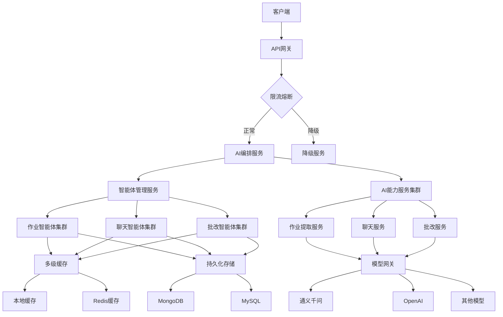

# 三高（高并发、高可用、高性能）解决方案

## 1. 高并发解决方案

### 1.1 异步非阻塞架构

```java
// 异步AI服务接口
public interface AsyncAIService {
    CompletableFuture<AIResponse> executeAsync(AIRequest request);
    CompletableFuture<List<AIResponse>> executeBatchAsync(List<AIRequest> requests);
}

// 异步作业提取服务实现
@Service
public class AsyncHomeworkExtractionService implements AsyncAIService {
    
    private final ExecutorService aiExecutor;
    private final ChatClient chatClient;
    
    public AsyncHomeworkExtractionService() {
        // 创建专用的AI处理线程池
        this.aiExecutor = new ThreadPoolExecutor(
            10,                    // 核心线程数
            50,                    // 最大线程数
            60L, TimeUnit.SECONDS, // 空闲线程存活时间
            new LinkedBlockingQueue<>(1000), // 任务队列
            new ThreadFactoryBuilder()
                .setNameFormat("ai-processor-%d")
                .setDaemon(true)
                .build(),
            new ThreadPoolExecutor.CallerRunsPolicy() // 拒绝策略
        );
    }
    
    @Override
    public CompletableFuture<AIResponse> executeAsync(AIRequest request) {
        return CompletableFuture.supplyAsync(() -> {
            try {
                // 执行AI处理逻辑
                return execute(request);
            } catch (Exception e) {
                log.error("AI processing failed", e);
                throw new AIProcessingException("AI processing failed", e);
            }
        }, aiExecutor);
    }
    
    @Override
    public CompletableFuture<List<AIResponse>> executeBatchAsync(List<AIRequest> requests) {
        // 批量处理优化
        if (requests.size() <= 10) {
            // 小批量：并行处理
            List<CompletableFuture<AIResponse>> futures = requests.stream()
                .map(this::executeAsync)
                .collect(Collectors.toList());
            return CompletableFuture.allOf(futures.toArray(new CompletableFuture[0]))
                .thenApply(v -> futures.stream()
                    .map(CompletableFuture::join)
                    .collect(Collectors.toList()));
        } else {
            // 大批量：分批处理
            return processInBatches(requests, 10);
        }
    }
}
```

### 1.2 连接池和资源管理

```java
// Redis连接池配置
@Configuration
public class RedisConfig {
    
    @Bean
    public LettuceConnectionFactory redisConnectionFactory() {
        LettuceClientConfiguration clientConfig = LettuceClientConfiguration.builder()
            .commandTimeout(Duration.ofSeconds(5))
            .shutdownTimeout(Duration.ZERO)
            .clientOptions(ClientOptions.builder()
                .disconnectedBehavior(ClientOptions.DisconnectedBehavior.REJECT_COMMANDS)
                .build())
            .poolConfig(GenericObjectPoolConfig.builder()
                .maxTotal(50)           // 最大连接数
                .maxIdle(20)            // 最大空闲连接
                .minIdle(5)             // 最小空闲连接
                .testOnBorrow(true)     // 借出时测试
                .testOnReturn(true)     // 归还时测试
                .build())
            .build();
            
        return new LettuceConnectionFactory(redisStandaloneConfiguration(), clientConfig);
    }
}

// HTTP连接池配置
@Configuration
public class HttpClientConfig {
    
    @Bean
    public CloseableHttpClient httpClient() {
        RequestConfig config = RequestConfig.custom()
            .setConnectTimeout(5000)
            .setSocketTimeout(30000)
            .setConnectionRequestTimeout(5000)
            .build();
            
        PoolingHttpClientConnectionManager connectionManager = 
            new PoolingHttpClientConnectionManager();
        connectionManager.setMaxTotal(200);        // 最大连接数
        connectionManager.setDefaultMaxPerRoute(50); // 每个路由最大连接数
        
        return HttpClients.custom()
            .setConnectionManager(connectionManager)
            .setDefaultRequestConfig(config)
            .evictIdleConnections(60, TimeUnit.SECONDS)
            .build();
    }
}
```

### 1.3 多级缓存策略

```java
// 多级缓存实现
@Component
public class MultiLevelCache {
    
    // 本地缓存（Caffeine）
    private final Cache<String, Object> localCache = Caffeine.newBuilder()
        .maximumSize(1000)              // 最大条目数
        .expireAfterWrite(10, TimeUnit.MINUTES) // 写后过期
        .recordStats()                  // 记录统计信息
        .build();
        
    // 分布式缓存（Redis）
    private final RedisTemplate<String, Object> redisTemplate;
    
    public <T> T get(String key, Class<T> type, Supplier<T> loader) {
        // 1. 先查本地缓存
        T result = (T) localCache.getIfPresent(key);
        if (result != null) {
            return result;
        }
        
        // 2. 再查Redis缓存
        String redisKey = buildRedisKey(key);
        result = (T) redisTemplate.opsForValue().get(redisKey);
        if (result != null) {
            // 回填本地缓存
            localCache.put(key, result);
            return result;
        }
        
        // 3. 缓存未命中，执行加载逻辑
        result = loader.get();
        if (result != null) {
            // 写入两级缓存
            localCache.put(key, result);
            redisTemplate.opsForValue().set(redisKey, result, Duration.ofHours(1));
        }
        
        return result;
    }
    
    // 缓存预热
    @Scheduled(fixedRate = 3600000) // 每小时
    public void warmUpCache() {
        // 预热热门AI提示词模板
        warmUpPromptTemplates();
        // 预热常用知识库片段
        warmUpKnowledgeFragments();
    }
}
```

### 1.4 限流和熔断

```java
// Sentinel限流配置
@Configuration
public class SentinelConfig {
    
    @PostConstruct
    public void initFlowRules() {
        List<FlowRule> rules = new ArrayList<>();
        
        // AI能力调用限流
        FlowRule aiRule = new FlowRule();
        aiRule.setResource("ai.capability.execute");
        aiRule.setGrade(RuleConstant.FLOW_GRADE_QPS);
        aiRule.setCount(100); // QPS限制为100
        aiRule.setControlBehavior(RuleConstant.CONTROL_BEHAVIOR_RATE_LIMITER);
        aiRule.setMaxQueueingTimeMs(500);
        rules.add(aiRule);
        
        // 智能体创建限流
        FlowRule agentRule = new FlowRule();
        agentRule.setResource("agent.create");
        agentRule.setGrade(RuleConstant.FLOW_GRADE_QPS);
        agentRule.setCount(50); // QPS限制为50
        rules.add(agentRule);
        
        FlowRuleManager.loadRules(rules);
    }
}

// 熔断降级策略
@SentinelResource(
    value = "ai.capability.execute",
    blockHandler = "handleFlowControl",
    fallback = "handleFallback"
)
public AIResponse executeWithCircuitBreaker(AIRequest request) {
    return aiCapability.execute(request);
}

public AIResponse handleFlowControl(AIRequest request, BlockException ex) {
    log.warn("Flow control triggered for request: {}", request);
    // 返回降级响应
    return createDegradedResponse("系统繁忙，请稍后再试");
}

public AIResponse handleFallback(AIRequest request, Throwable ex) {
    log.error("AI capability execution failed", ex);
    // 返回兜底响应
    return createFallbackResponse("服务暂时不可用");
}
```

## 2. 高可用解决方案

### 2.1 服务集群和负载均衡

```yaml
# Kubernetes部署配置 (homework-agent-deployment.yaml)
apiVersion: apps/v1
kind: Deployment
metadata:
  name: homework-agent-service
spec:
  replicas: 3
  selector:
    matchLabels:
      app: homework-agent
  template:
    metadata:
      labels:
        app: homework-agent
    spec:
      containers:
      - name: homework-agent
        image: luckyboot/homework-agent:latest
        ports:
        - containerPort: 8080
        resources:
          requests:
            memory: "512Mi"
            cpu: "500m"
          limits:
            memory: "1Gi"
            cpu: "1000m"
        livenessProbe:
          httpGet:
            path: /actuator/health
            port: 8080
          initialDelaySeconds: 30
          periodSeconds: 10
        readinessProbe:
          httpGet:
            path: /actuator/health
            port: 8080
          initialDelaySeconds: 10
          periodSeconds: 5
---
apiVersion: v1
kind: Service
metadata:
  name: homework-agent-service
spec:
  selector:
    app: homework-agent
  ports:
  - protocol: TCP
    port: 80
    targetPort: 8080
  type: ClusterIP
```

### 2.2 自动扩缩容

```java
// 基于指标的自动扩缩容
@Component
public class AutoScalingManager {
    
    private final KubernetesClient k8sClient;
    private final MeterRegistry meterRegistry;
    
    @Scheduled(fixedRate = 30000) // 每30秒检查一次
    public void checkAndScale() {
        // 获取当前CPU使用率
        double cpuUsage = getCpuUsage();
        int currentReplicas = getCurrentReplicaCount();
        
        if (cpuUsage > 0.7 && currentReplicas < 10) {
            // CPU使用率过高，扩容
            scaleUp(currentReplicas + 1);
        } else if (cpuUsage < 0.3 && currentReplicas > 2) {
            // CPU使用率过低，缩容
            scaleDown(currentReplicas - 1);
        }
        
        // 基于请求队列长度的扩缩容
        long pendingRequests = getPendingRequestCount();
        if (pendingRequests > 100 && currentReplicas < 10) {
            scaleUp(Math.min(currentReplicas + 2, 10));
        }
    }
    
    private void scaleUp(int newReplicas) {
        k8sClient.apps().deployments()
            .inNamespace("default")
            .withName("homework-agent-service")
            .scale(newReplicas);
        log.info("Scaled up to {} replicas", newReplicas);
    }
}
```

### 2.3 故障转移和健康检查

```java
// 健康检查端点
@RestController
public class HealthCheckController {
    
    private final AIModelHealthChecker modelHealthChecker;
    private final CacheHealthChecker cacheHealthChecker;
    private final DatabaseHealthChecker dbHealthChecker;
    
    @GetMapping("/actuator/health")
    public ResponseEntity<HealthStatus> healthCheck() {
        HealthStatus status = HealthStatus.builder()
            .status("UP")
            .timestamp(LocalDateTime.now())
            .build();
            
        // 检查AI模型服务
        if (!modelHealthChecker.isHealthy()) {
            status.setStatus("DOWN");
            status.addDetail("ai-model", "DOWN");
        }
        
        // 检查缓存服务
        if (!cacheHealthChecker.isHealthy()) {
            status.setStatus("DOWN");
            status.addDetail("cache", "DOWN");
        }
        
        // 检查数据库
        if (!dbHealthChecker.isHealthy()) {
            status.setStatus("DOWN");
            status.addDetail("database", "DOWN");
        }
        
        HttpStatus statusCode = "UP".equals(status.getStatus()) ? 
            HttpStatus.OK : HttpStatus.SERVICE_UNAVAILABLE;
            
        return ResponseEntity.status(statusCode).body(status);
    }
}

// 故障转移机制
@Component
public class FailoverManager {
    
    private final List<AIModelProvider> modelProviders;
    private final AtomicInteger currentProviderIndex = new AtomicInteger(0);
    
    public AIResponse executeWithFailover(AIRequest request) {
        Exception lastException = null;
        
        for (int i = 0; i < modelProviders.size(); i++) {
            int providerIndex = (currentProviderIndex.get() + i) % modelProviders.size();
            AIModelProvider provider = modelProviders.get(providerIndex);
            
            try {
                AIResponse response = provider.execute(request);
                // 更新当前提供者（成功时）
                currentProviderIndex.set(providerIndex);
                return response;
            } catch (Exception e) {
                lastException = e;
                log.warn("Provider {} failed, trying next provider", provider.getName(), e);
            }
        }
        
        throw new AIExecutionException("All providers failed", lastException);
    }
}
```

### 2.4 数据持久化和备份

```java
// 智能体状态持久化
@Repository
public class AgentStateRepository {
    
    private final MongoTemplate mongoTemplate;
    private final RedisTemplate<String, AgentState> redisTemplate;
    
    // 双写策略：同时写入MongoDB和Redis
    public void saveAgentState(String agentId, AgentState state) {
        // 1. 写入Redis（快速访问）
        redisTemplate.opsForValue().set(
            "agent:state:" + agentId, 
            state, 
            Duration.ofHours(24)
        );
        
        // 2. 写入MongoDB（持久化）
        AgentStateDocument document = convertToDocument(agentId, state);
        mongoTemplate.save(document, "agent_states");
    }
    
    // 读取策略：优先从Redis读取，Redis未命中则从MongoDB读取
    public AgentState getAgentState(String agentId) {
        AgentState state = redisTemplate.opsForValue().get("agent:state:" + agentId);
        if (state != null) {
            return state;
        }
        
        // 从MongoDB读取
        Query query = Query.query(Criteria.where("agentId").is(agentId));
        AgentStateDocument document = mongoTemplate.findOne(query, AgentStateDocument.class, "agent_states");
        if (document != null) {
            state = convertFromDocument(document);
            // 回填Redis
            redisTemplate.opsForValue().set(
                "agent:state:" + agentId, 
                state, 
                Duration.ofHours(24)
            );
            return state;
        }
        
        return null;
    }
}
```

## 3. 高性能解决方案

### 3.1 模型缓存和预加载

```java
// 模型结果缓存
@Component
public class ModelResultCache {
    
    private final Cache<String, AIResponse> cache = Caffeine.newBuilder()
        .maximumSize(10000)
        .expireAfterWrite(1, TimeUnit.HOURS)
        .recordStats()
        .build();
        
    public AIResponse getCachedOrExecute(AIRequest request, AICapability capability) {
        String cacheKey = generateCacheKey(request);
        AIResponse cached = cache.getIfPresent(cacheKey);
        
        if (cached != null) {
            log.debug("Cache hit for request: {}", cacheKey);
            return cached;
        }
        
        // 执行AI能力
        AIResponse result = capability.execute(request);
        
        // 缓存结果（仅缓存成功的响应）
        if (result != null && result.isSuccess()) {
            cache.put(cacheKey, result);
        }
        
        return result;
    }
    
    private String generateCacheKey(AIRequest request) {
        // 基于请求内容生成缓存键
        return Hashing.sha256()
            .hashString(request.toString(), StandardCharsets.UTF_8)
            .toString();
    }
}

// 提示词模板预加载
@Component
public class PromptTemplatePreloader {
    
    private final Map<String, String> preloadedTemplates = new ConcurrentHashMap<>();
    
    @PostConstruct
    public void preloadTemplates() {
        // 预加载作业提取提示词
        preloadedTemplates.put("homework_extraction", loadTemplateFromFile("homework_extraction.txt"));
        // 预加载聊天提示词
        preloadedTemplates.put("chat_tutor", loadTemplateFromFile("chat_tutor.txt"));
        // 预加载批改提示词
        preloadedTemplates.put("grading_essay", loadTemplateFromFile("grading_essay.txt"));
    }
    
    public String getTemplate(String templateName) {
        return preloadedTemplates.get(templateName);
    }
}
```

### 3.2 批处理和向量化

```java
// 批处理优化
@Component
public class BatchProcessor {
    
    private final Queue<BatchItem> batchQueue = new ConcurrentLinkedQueue<>();
    private final ScheduledExecutorService scheduler = Executors.newScheduledThreadPool(1);
    
    @PostConstruct
    public void startBatchProcessing() {
        // 每100ms或达到批次大小时处理
        scheduler.scheduleAtFixedRate(this::processBatch, 100, 100, TimeUnit.MILLISECONDS);
    }
    
    public CompletableFuture<AIResponse> addToBatch(AIRequest request) {
        CompletableFuture<AIResponse> future = new CompletableFuture<>();
        batchQueue.add(new BatchItem(request, future));
        return future;
    }
    
    private void processBatch() {
        if (batchQueue.isEmpty()) {
            return;
        }
        
        // 收集批次
        List<BatchItem> batch = new ArrayList<>();
        batchQueue.drainTo(batch, 10); // 最多10个
        
        if (batch.isEmpty()) {
            return;
        }
        
        try {
            // 批量执行
            List<AIRequest> requests = batch.stream()
                .map(BatchItem::getRequest)
                .collect(Collectors.toList());
                
            List<AIResponse> responses = aiCapability.executeBatch(requests);
            
            // 完成所有future
            for (int i = 0; i < batch.size(); i++) {
                batch.get(i).getFuture().complete(responses.get(i));
            }
        } catch (Exception e) {
            // 处理异常
            batch.forEach(item -> item.getFuture().completeExceptionally(e));
        }
    }
}

// 向量化检索优化
@Component
public class VectorSearchOptimizer {
    
    private final VectorStore vectorStore;
    private final Cache<String, List<VectorSearchResult>> searchCache;
    
    public List<KnowledgeChunk> searchKnowledge(String query, String subject) {
        String cacheKey = query + ":" + subject;
        List<VectorSearchResult> cached = searchCache.getIfPresent(cacheKey);
        
        if (cached != null) {
            return convertToKnowledgeChunks(cached);
        }
        
        // 执行向量搜索
        List<VectorSearchResult> results = vectorStore.search(
            query, 
            Map.of("subject", subject), 
            5 // 返回前5个结果
        );
        
        // 缓存结果
        searchCache.put(cacheKey, results);
        
        return convertToKnowledgeChunks(results);
    }
}
```

### 3.3 性能监控和调优

```java
// 性能监控指标
@Component
public class PerformanceMonitor {
    
    private final Timer aiExecutionTimer;
    private final Counter aiExecutionCounter;
    private final Gauge activeAgentsGauge;
    
    public PerformanceMonitor(MeterRegistry registry) {
        this.aiExecutionTimer = Timer.builder("ai.execution.time")
            .description("AI execution time")
            .register(registry);
            
        this.aiExecutionCounter = Counter.builder("ai.execution.count")
            .description("AI execution count")
            .register(registry);
            
        this.activeAgentsGauge = Gauge.builder("agent.active.count")
            .description("Active agent count")
            .register(registry, agentManager, AgentLifecycleManager::getActiveAgentCount);
    }
    
    public <T> T monitorExecution(Supplier<T> operation, String capability) {
        aiExecutionCounter.increment();
        return aiExecutionTimer.recordCallable(() -> {
            T result = operation.get();
            // 记录额外标签
            return result;
        });
    }
}

// 动态调优
@Component
public class DynamicTuningManager {
    
    @Scheduled(fixedRate = 60000) // 每分钟
    public void tuneParameters() {
        // 基于性能指标动态调整参数
        double avgResponseTime = getAverageResponseTime();
        double errorRate = getErrorRate();
        
        if (avgResponseTime > 5000) { // 响应时间超过5秒
            // 降低模型复杂度
            adjustModelParameters("simpler");
        }
        
        if (errorRate > 0.1) { // 错误率超过10%
            // 切换到更稳定的模型
            switchToStableModel();
        }
    }
}
```

## 4. 三高架构总结

### 4.1 架构图



### 4.2 关键指标

| 指标 | 目标值 | 监控方式 |
|------|--------|----------|
| QPS | ≥ 1000 | Prometheus + Grafana |
| 响应时间 | ≤ 2s (P95) | SkyWalking |
| 可用性 | ≥ 99.9% | 健康检查 + 告警 |
| 缓存命中率 | ≥ 80% | Micrometer |
| 错误率 | ≤ 1% | 日志分析 |

### 4.3 应急预案

1. **流量激增**：自动限流 + 降级策略 + 自动扩容
2. **模型服务故障**：故障转移 + 本地缓存兜底
3. **数据库故障**：读写分离 + 备份恢复
4. **网络分区**：服务降级 + 本地状态保持