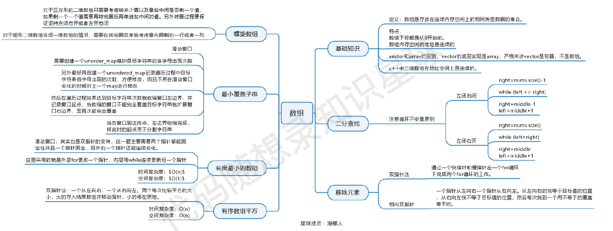

> 数组内存空间的地址是连续的；数组元素是不能删除的，只能覆盖
- C++中二维数组子啊内存的空间地址是连续的，Java不是

## 1. 二分查找 704
> 给定一个 n 个元素有序的（升序）整型数组 nums 和一个目标值 target  ，写一个函数搜索 nums 中的 target，如果目标值存在返回下标，否则返回 -1。
- 区间的定义要清晰，循环不变：左闭右开/左闭右闭
- 左闭右开： 0～length
- 左闭右闭： 0～length-1

```java
class Solution {
    public int search(int[] nums, int target) {
        int left = 0;
        int right = nums.length - 1;
        while (left <= right) {
            int mid = (left + right)/2;
            int val = nums[mid];
            if (val > target) {
                right = mid - 1;
            } else if (val < target) {
                left = mid + 1;
            } else {
                return mid;
            }
        }
        return -1;
    }
}
```

### 搜索插入位置 35
> 给定一个排序数组和一个目标值，在数组中找到目标值，并返回其索引。如果目标值不存在于数组中，返回它将会被按顺序插入的位置。
**请必须使用时间复杂度为 O(log n) 的算法。**
    
**提示:**
- 1 <= nums.length <= 104
- -104 <= nums[i] <= 104
- nums 为 无重复元素 的 升序 排列数组
- -104 <= target <= 104

```java
class Solution {
    public int searchInsert(int[] nums, int target) {
        ...//(同上)
        return left; // (return -1 改成 return left;)
    }
}
```

### 在排序数组中查找元素的第一个和最后一个位置 34
> 给你一个按照非递减顺序排列的整数数组 nums，和一个目标值 target。请你找出给定目标值在数组中的开始位置和结束位置。
如果数组中不存在目标值 target，返回 [-1, -1]。
**你必须设计并实现时间复杂度为 O(log n) 的算法解决此问题。**
- 分两次查，一次查左边界，一次查右边界
- 也可一次查，查完往左右两边拓展查
- 或者一次查，查到后左右递归（效率低）

```java
class Solution {
    public int[] searchRange(int[] nums, int target) {
        int[] ans = new int[]{-1, -1};
        deepSearch(nums, target, ans, 0);
        deepSearch(nums, target, ans, 1);
        return ans;
    }

    private static void deepSearch(int[] nums, int target, int[] border, int mode) {
        int left = 0;
        int right = nums.length - 1;
        while (left <= right) {
            int mid = (left + right)/2;
            int val = nums[mid];
            if (val > target) {
                right = mid - 1;
            } else if (val < target) {
                left = mid + 1;
            } else {
                if (mode == 0) {
                    border[0] = mid;
                    right = mid - 1;
                } else if (mode == 1) {
                    border[1] = mid;
                    left = mid + 1;
                }
            }
        }
    }
}
```

## 2. 移除元素 27
> 给你一个数组 nums 和一个值 val，你需要 原地 移除所有数值等于 val 的元素。元素的顺序可能发生改变。然后返回 nums 中与 val 不同的元素的数量。
> * 假设 nums 中不等于 val 的元素数量为 k，要通过此题，您需要执行以下操作：
> * 更改 nums 数组，使 nums 的前 k 个元素包含不等于 val 的元素。nums 的其余元素和 nums 的大小并不重要。
> * 返回 k。
* 暴力解法：两层for循环，一层遍历，一层更新数组（时间O(n^2)，空间O(1)）
* 双指针法（快慢指针法）： 通过⼀个快指针和慢指针在⼀个for循环下完成两个for循环的⼯作
    * 快指针：寻找新数组的元素 ，新数组就是不含有⽬标元素的数组
    * 慢指针：指向更新 新数组下标的位置

```java
// 时间复杂度：O(n)
// 空间复杂度：O(1)
class Solution {
    public:
    int removeElement(vector<int>& nums, int val) {
        int slowIndex = 0;
        for (int fastIndex = 0; fastIndex < nums.size(); fastIndex++) {
            if (val != nums[fastIndex]) {
                nums[slowIndex++] = nums[fastIndex];
            }
        }
        return slowIndex;
    }
};
```
* 相向双指针⽅法，基于元素顺序可以改变的题⽬描述改变了元素相对位置，确保了移动最少元素

```java
// 时间复杂度：O(n)
// 空间复杂度：O(1)
class Solution {
    public:
    int removeElement(vector<int>& nums, int val) {
        int leftIndex = 0;
        int rightIndex = nums.size() - 1;
        while (leftIndex <= rightIndex) {
            // 找左边等于val的元素
            while (leftIndex <= rightIndex && nums[leftIndex] != val){
                ++leftIndex;
            }
            // 找右边不等于val的元素
            while (leftIndex <= rightIndex && nums[rightIndex] == val) {
                -- rightIndex;
            }
            // 将右边不等于val的元素覆盖左边等于val的元素
            if (leftIndex < rightIndex) {
                nums[leftIndex++] = nums[rightIndex--];
            }
        }
        return leftIndex;
        // leftIndex⼀定指向了最终数组末尾的下⼀个元素
    }
};
```
### 删除排序数组中的重复项 26
### 移动零 283
### ⽐较含退格的字符串 844
### 有序数组的平⽅ 977

## 3. 有序数组的平方


## 4. 长度最小的子数组
## 5. 螺旋矩阵II
## 6. 总结

